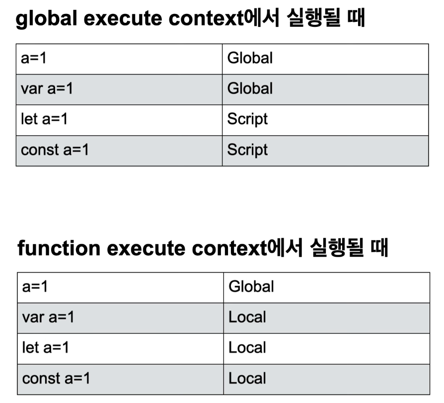

# execution context

<br>

JavaScript에서 가장 중요한 개념 중 하나인 실행 컨텍스트. 여전히 단어의 조합만으로는 어떤 역할을 하는 녀석인지 감이 전혀오지 않는다. 하지만 이녀석만 이해하면, hoisting, scope, closure, this 등의 그간 이해하기 어려웠 던 개념들이 한번에 이해가 갈 것이다. (언급되는 녀석들의 체급을 봐도 만만치 않은 놈인건 확실하다.)

<br>

한 문장으로 줄이기는 상당히 어렵겠지만, 많은 시간 구글링을 하고 학습 한 결과 나름대로의 정의를 내려보자면, 실행 컨텍스트는

> **실행할 코드에 제공할 환경 정보들을 모아놓은 객체**

라고 할 수 있겠다.

<br>

실행 컨텍스트는 다음의 네가지 유형의 코드가 실행될 때 생성된다.

- **전역 코드 global code**
  - 전역에 존재하는 소스 코드. 해당 코드가 평가되면 전역 실행 컨텍스트가 생성된다.
- **함수 코드 function code**
  - 함수 내부에 존재하는 소스 코드. 함수 코드가 평가되면 함수 실행 컨텍스트가 생성된다.
- **eval 코드 eval code**
  - eval 함수에 인수로 전달되어 실행되는 소스 코드. strict mode에서 eval 실행 컨텍스트를 생성한다.
  - eval : 문자열로 표현된 자바스크립트 코드를 실행하는 데 사용 되는 자바스크립트 내장 함수. 보안상의 이유로 사용자 입력과 같은 외부에서 제공된 문자열을 eval로 실행하는 것을 주의해야 한다. (그냥 이제는 안쓴다고 생각하면 된다.)
- **모듈 코드 module code**
  - 모듈 내부에 존재하는 소스 코드. 각 모듈은 평가시 모듈별로 독립적인 모듈 실행 컨텍스트를 생성한다.

<br>

실행 컨텍스트가 생성 될 때, scope를 관리하는 역할은 `Lexical Environment`가 담당하고, 코드의 실행 순서를 관리하는 역할은 `Execution Context Stack`(Call Stack)이 담당한다.

<br>

<center>
  
</center>

<br>

자바스크립트는 상단의 4가지 소스 코드가 실행될 때 마다 실행 컨텍스트를 생성한다. 실행 컨텍스트들은 스택 자료구조로 관리된다. 이 스택 자료구조를 **실행 컨텍스트 스택**이라고 한다.

4가지 소스 코드가 실행되면 실행 컨텍스트가 생성되어 실행 컨텍스트 스택에 push되며, 코드 실행이 마무리되면 해당 코드의 실행 컨텍스트가 pop된다. 이처럼 실행 컨텍스트 스택에 실행 컨텍스트들이 순서대로 push되고 pop되면서 현재 실행중인 코드가 무엇인지 알 수 있으며, 실행 중인 코드가 끝난 후 어느 코드로 되돌아 갈지도 알 수 있다.

이처럼 실행 컨텍스트 스택은 **코드의 실행 순서를 관리**한다.

<br>

하나의 실행 컨텍스트는 다음과 같은 구조로 이루어져 있다.

<br>

- **VariableEnvironment**
  - 현재 컨텍스트 내의 식별자들에 대한 정보 (`EnvironmentRecord`)
  - 외부 환경 정보 (`OuterEnvironmentReference`)
  - 선언 시점에서 스냅샷처럼 동작하여 이후의 변경 사항은 반영되지 않음
- **LexicalEnvironment**
  - VariableEnvironment와 같지만, 변경 사항이 실시간으로 반영됨
  - 여기서 hoisting이 발생한다.
- **ThisBinding**
  - this 식별자가 바라봐야 할 대상 객체
  - this 바인딩은 함수 호출 패턴에 의해 동적으로 결정된다.

<br>
<br>
<br>

```html
<script>
  n0 = "n0"; // global scope
  var v0 = "v0"; // global scope
  let l0 = "l0"; // script scope
  const c0 = "c0"; // script scope
  console.log(v0, n0, l0, c0); // v0, n0, l0, c0
  console.log(window.v0, window.n0, window.l0, window.c0); // v0, n0, undefined, undefined
  function fn2() {
    n2 = "n2";
    console.log(n0, n1, n2);
    var v2 = "v2";
    console.log(v0, v2);
    // console.log(v1) // v1 is not defined
    let l2 = "l2";
    console.log(l0, l2);
    // console.log(l1);
    const c2 = "c2;";
    console.log(c0, c2);
    // console.log(c1);
  }
  function fn1() {
    n1 = "n1"; // global scope
    var v1 = "v1"; // local scope
    let l1 = "l1"; // local scope
    const c1 = "c1"; // local scope
    fn2(); // fn2가 선언 될 때의 scope를 기억하고 있음
  }
  fn1();
  console.log(n2);
  // console.log(v2, l2, c2); // v2, l2, c2 is not defined
</script>
```



## scope chain

Local -> Script -> Global

### 출처

[생활코딩님 유튜브](https://www.youtube.com/watch?v=QtOF0uMBy7k&ab_channel=%EC%83%9D%ED%99%9C%EC%BD%94%EB%94%A9)
[준일님 블로그](https://junilhwang.github.io/TIL/Javascript/Domain/Execution-Context/#_2-%E1%84%89%E1%85%B5%E1%86%AF%E1%84%92%E1%85%A2%E1%86%BC-%E1%84%8F%E1%85%A5%E1%86%AB%E1%84%90%E1%85%A6%E1%86%A8%E1%84%89%E1%85%B3%E1%84%90%E1%85%B3-%E1%84%80%E1%85%AE%E1%84%89%E1%85%A5%E1%86%BC)
