# Web 15. BaekjoonRooms

Real-time Online Coding Competition Platform

---

한번도 (리액트를) 경험하지 못한
세명의 프론트개발자(진)이 모였다!

이것은 props인가 state인가!

**극한개발!**

---

고민 1. 상태관리가 그렇게 중요하다던데, 라이브러리는 뭘 쓰지?

고민 2. 라우팅? SPA에 라우팅이 있어?

고민 3. react-query와 suspense는 필수라고 하시던데 이건 또 뭐지?

---

오늘은 고민1과 고민2에 대한 경험을 공유해보겠습니다. (고민 1, 3 은 다음에...)

~~**고민 1. 상태관리**가 그렇게 중요하다던데, 라이브러리는 뭘 쓰지?~~

**고민 2. 라우팅**? SPA에 라우팅이 있어?

~~고민 3. react-query와 suspense는 필수라고 하시던데 이건 또 뭐지?~~

---

<!-- header: react-router-dom -->

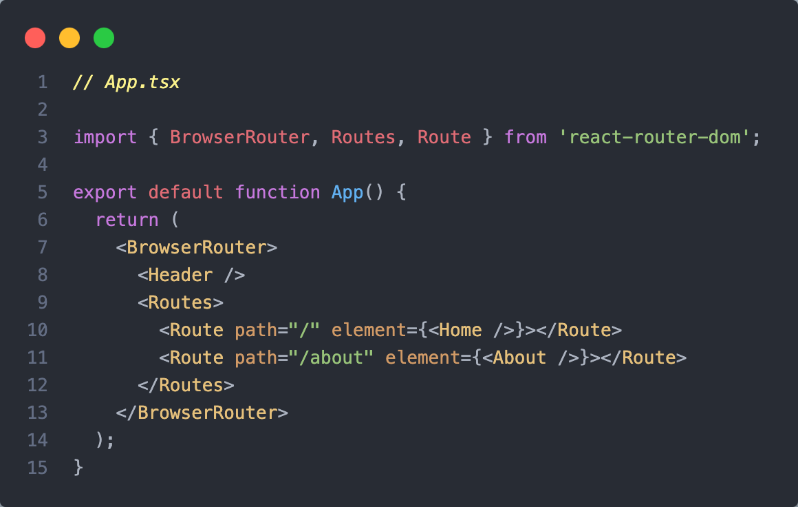
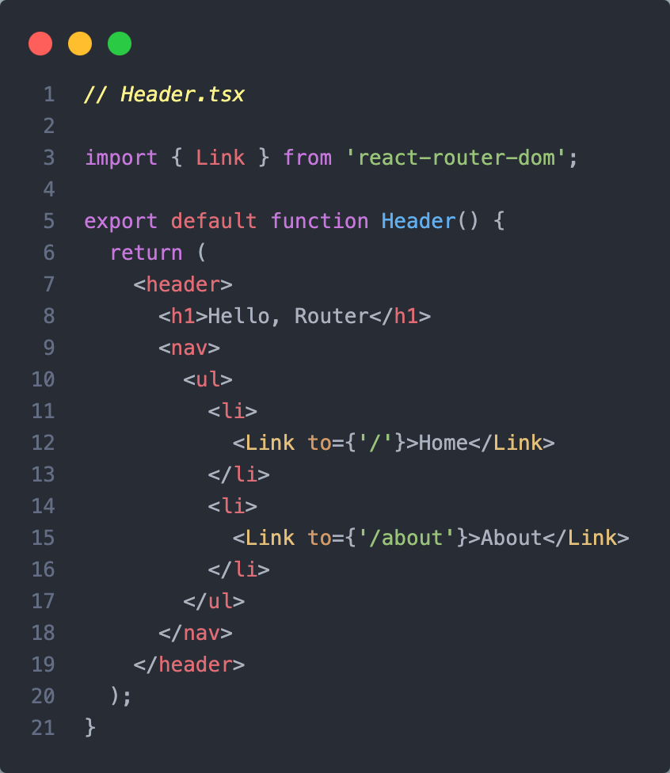

---

<!-- header: react-router-dom -->

## createBrowserRouter

> This is the recommended router for all React Router web projects. It uses the DOM History API to update the URL and manage the history stack.
>
> It also enables the v6.4 data APIs like loaders, actions, fetchers and more.

모든 React 라우터 웹 프로젝트에 권장되는 라우터이다.
DOM History API를 사용해 URL을 업데이트하고 history stack을 관리한다. 또한 loaders, actions, fetchers 등과 같은 **data APIs**를 사용할 수 있다.

---

<!-- header: react-router-dom -->

## 1. 라우터를 독립시키자!

## 2. data APIs를 활용해보자!

---

<!-- header: 1. 라우터를 독립시키자! -->

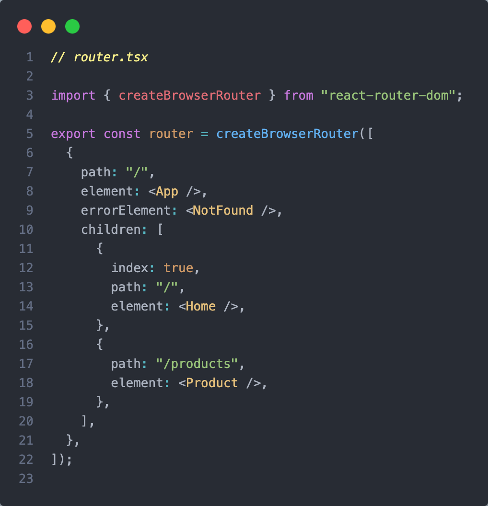
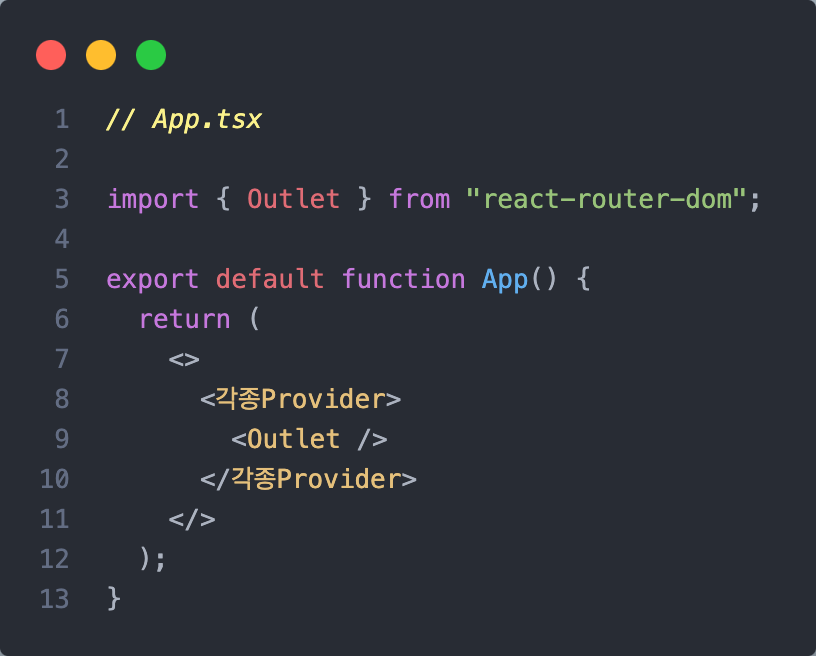

---

<!-- header: 1. 라우터를 독립시키자! -->

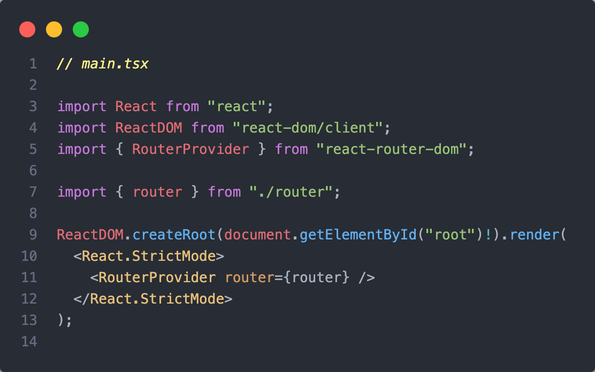
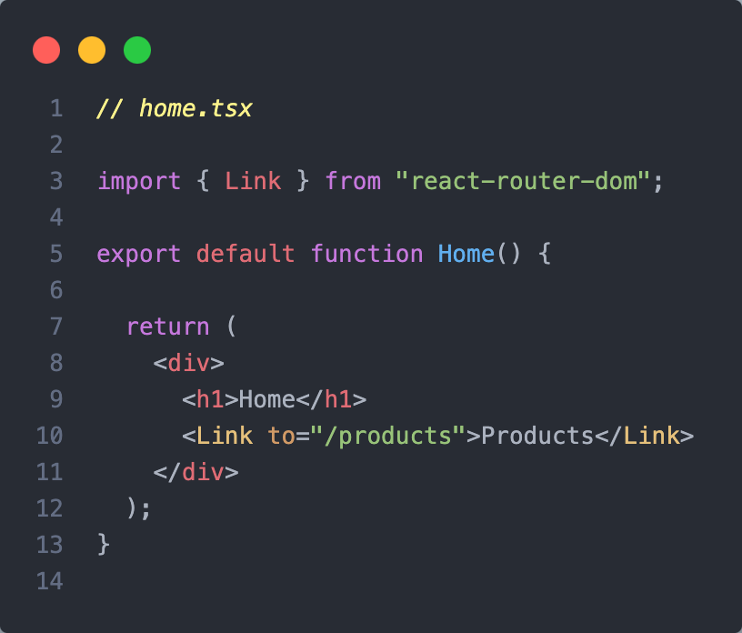

---

<!-- header: 2. data APIs를 활용해보자! -->

## What is data APIs?

- 데이터를 로드, 변경 및 재검증할 시점에 관한 것. (when to load, mutate, and revalidate data)

- 라우팅을 위한 데이터 로딩 및 처리를 보다 효율적으로 관리할 수 있도록 하는 기능.

---

<!-- header: 2. data APIs를 활용해보자! -->

단편적인 예)

- 만약에 `Product Page` 에 Component가 매우 많고, 각 Component가 다른 API를 호출한다면?
- 그래서 페이지를 렌더하니 각 Component마다 로드되는 속도가 달라 뿅뿅뿅 나타난다면?
- 그리고 그게 꼴뵈기 싫다면?!

---

<!-- header: 2. data APIs를 활용해보자! -->

모든 Route는 `"loader"`함수를
정의할 수 있고, 각 라우트가 렌더링되기 전에 호출됩니다.

그리고 해당 data는 `useLoaderData`를 통해 접근할 수 있습니다.

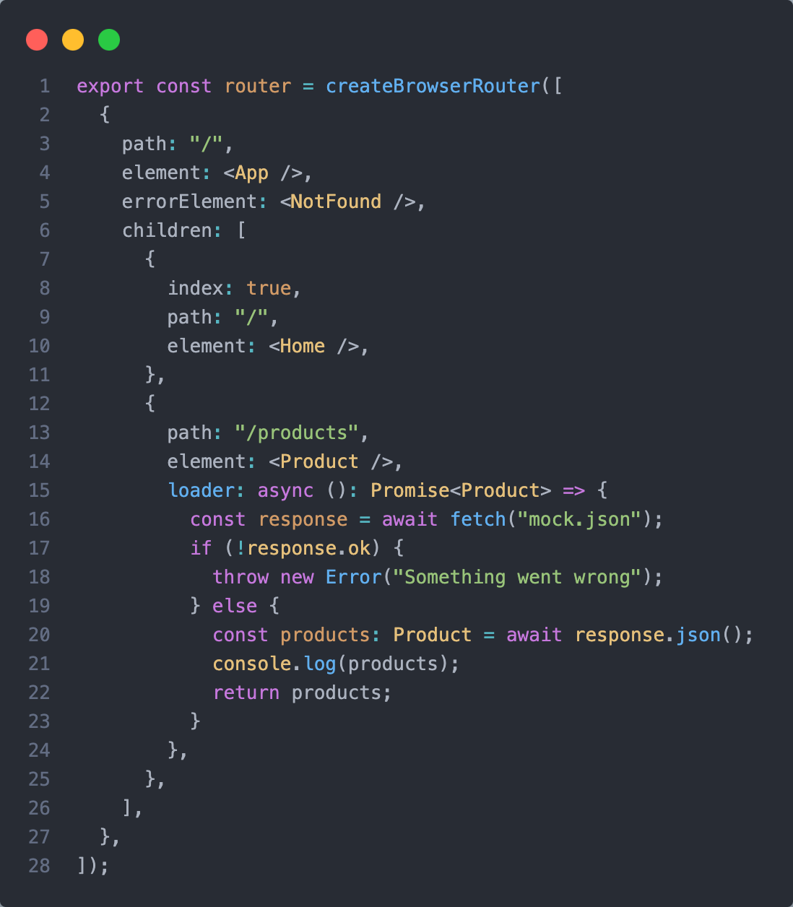

---

<!-- header: 2. data APIs를 활용해보자! -->

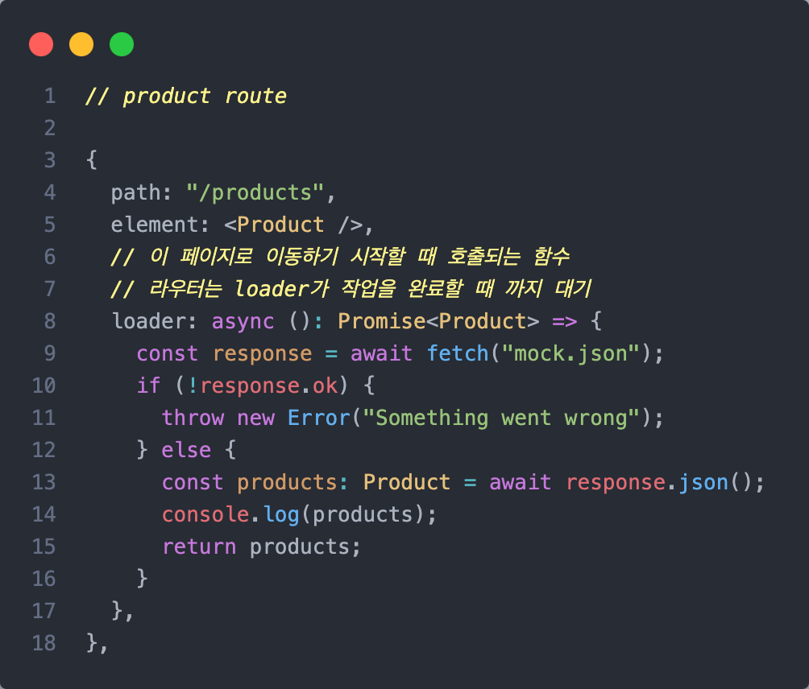
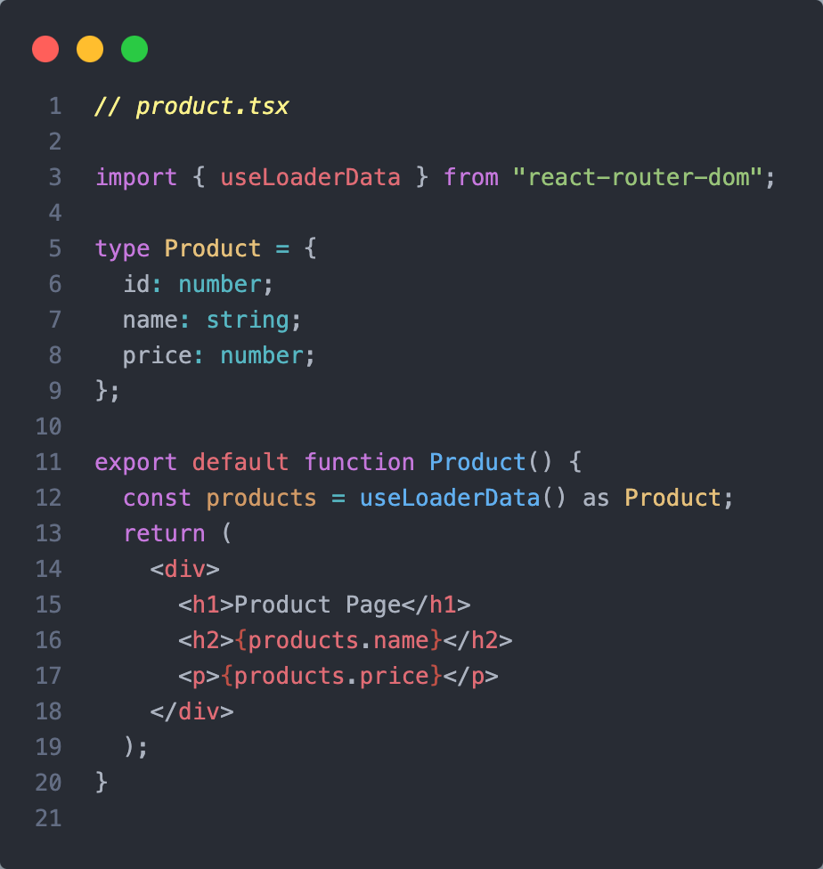

---

<!-- header: 2. data APIs를 활용해보자! -->

만약에 시간이 아주 많이 걸린다면?

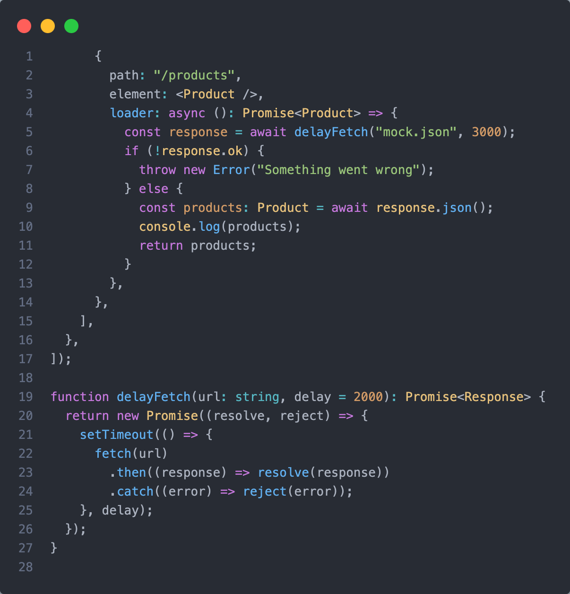

---

<!-- header: 2. data APIs를 활용해보자! -->

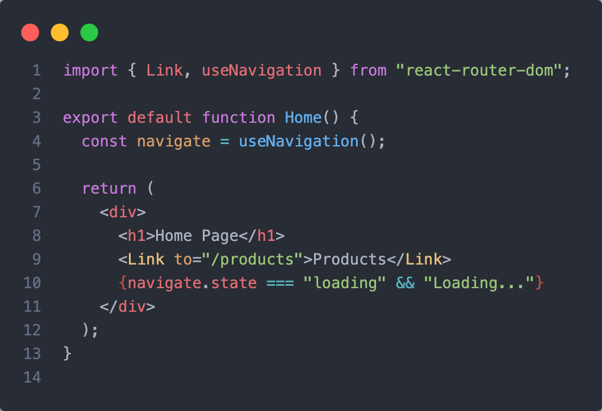

---

<!-- header: 2. data APIs를 활용해보자! -->

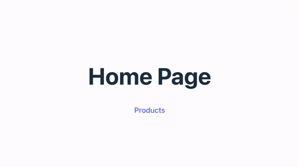

---

# 감사합니다!
